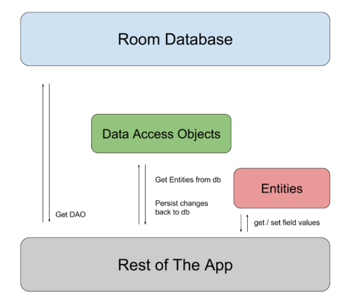

## 1. So sánh SQLite và MySQL

SQLite và MySQL đều là **hệ quản trị cơ sở dữ liệu quan hệ mã nguồn mở**, tuy nhiên có một số điểm khác biệt quan trọng.

### Khái niệm

**SQLite** là hệ quản trị cơ sở dữ liệu **gọn nhẹ, đơn giản**, không cần mô hình **server-client**, không cần **cài đặt, cấu hình hay khởi động**. Không có khái niệm **user, password, phân quyền**, dữ liệu được lưu trong **một file duy nhất**.

**MySQL** là hệ quản trị cơ sở dữ liệu **phổ biến, tốc độ nhanh, dễ sử dụng**, hoạt động theo **kiến trúc client-server**, cần **máy chủ** để chạy và hỗ trợ **quản lý người dùng, phân quyền**.

---

### Hỗ trợ kiểu dữ liệu

**SQLite** hỗ trợ ít kiểu dữ liệu: **NULL, INTEGER, REAL, TEXT, BLOB**.

**MySQL** hỗ trợ **nhiều kiểu dữ liệu phong phú**: số nguyên (**TINYINT, INT, BIGINT**), số thực (**FLOAT, DOUBLE, DECIMAL**), ngày giờ (**DATE, DATETIME, TIMESTAMP**), chuỗi (**CHAR, VARCHAR, TEXT**), nhị phân (**BLOB**), và đặc biệt (**ENUM, SET**).

---

### Lưu trữ

**SQLite** có dung lượng **250 KB**, dữ liệu nằm trong **một file .db**, dễ **sao chép, backup**, không cần cấu hình phức tạp.

**MySQL** có dung lượng cài đặt **600 MB**, dữ liệu được lưu trong **nhiều file**, khi **backup** cần **dump/export**, với cơ sở dữ liệu lớn sẽ **tốn nhiều thời gian**.

---

### Truy cập

**SQLite** không hỗ trợ **nhiều người dùng đồng thời**, khi ghi dữ liệu sẽ **bị khóa file**, không có **quản lý user**.

**MySQL** hỗ trợ **nhiều kết nối đồng thời**, có **hệ thống quản lý user** và **phân quyền chi tiết**, cho phép nhiều người ghi dữ liệu cùng lúc.

---

### Khả năng mở rộng

**SQLite** phù hợp cho **ứng dụng nhỏ, dữ liệu vừa phải**, khi dữ liệu lớn hơn vài GB sẽ **giảm hiệu năng**, khó **tối ưu**.

**MySQL** dễ **mở rộng**, xử lý dữ liệu **lớn (GB → TB)**, hỗ trợ **index, replication, clustering**, phù hợp cho **hệ thống nhiều người dùng**.

---

### Bảo mật

**SQLite** không có **xác thực tích hợp**, bảo mật phụ thuộc **hệ điều hành hoặc ứng dụng**.

**MySQL** có **bảo mật mạnh**, hỗ trợ **username, password, SSL/SSH, phân quyền chi tiết**.

---

### Trường hợp sử dụng

**SQLite** lý tưởng cho: **ứng dụng nhỏ, di động, lưu trữ offline, phát triển – kiểm thử, website nhỏ (<100 lượt truy cập/ngày)**.

**MySQL** thích hợp cho: **ứng dụng nhiều người dùng, hệ thống phân tán, cơ sở dữ liệu lớn, ứng dụng web, thương mại điện tử, blog, website >100 lượt/ngày**.

---
Hiểu rồi 👍. Mình sẽ viết lại phần **Room Database – Cách tạo Room Database trong Android** theo đúng cấu trúc bạn đưa, chi tiết đầy đủ, có code + giải thích từng bước, giữ format theo **2.1, 2.2, B1, B2,… B5** để bạn dễ dùng làm tài liệu.

---

## 2. Room Database - Cách tạo Room Database trong Android

---

### 2.1 Room Database

**Room Database** là một thành phần trong **Android Architecture Components**.

* **Nguồn gốc**: Room được phát triển và cải tiến từ **SQLite**.
* **Mục đích**: giúp đơn giản hóa việc viết code và giảm thiểu các công đoạn phức tạp khi làm việc với CSDL.
* **Bản chất**: là một **lớp trừu tượng (abstract layer)** bọc quanh SQLite chuẩn mà Android cung cấp.

#### Các thành phần bên trong của Room Database

1. **Database class**: lưu giữ toàn bộ cơ sở dữ liệu, là điểm truy cập chính tới DAO và dữ liệu.
2. **Entities**: biểu diễn các bảng (tables) trong cơ sở dữ liệu.
3. **DAOs (Data Access Objects)**: chứa các phương thức để truy vấn, chèn, cập nhật, xóa dữ liệu.




#### Entities

Entity là lớp đại diện cho một bảng trong cơ sở dữ liệu.

Ví dụ:

```kotlin
@Entity
data class User(
  @PrimaryKey val uid: Int,
  @ColumnInfo(name = "first_name") val firstName: String?,
  @ColumnInfo(name = "last_name") val lastName: String?
)
```

**Các annotation quan trọng**

* `@Entity`: đánh dấu một class là một bảng trong CSDL. Có thể dùng `tableName` để đổi tên bảng.
* `@PrimaryKey`: định nghĩa khóa chính của bảng. Có thể thêm `autoGenerate = true` để tự tăng.
* `@ColumnInfo`: đặt lại tên cột, nếu không có thì Room sẽ lấy tên biến làm tên cột.
* `@Ignore`: bỏ qua một trường, không lưu vào bảng.
* `@Index`: tạo chỉ mục, có thể kèm `unique = true`.

Ví dụ nâng cao:

```kotlin
@Entity(
    tableName = "users",
    indices = [Index(value = ["first_name", "last_name"], unique = true)]
)
data class User(
    @PrimaryKey(autoGenerate = true) val id: Int,
    val first_name: String,
    val last_name: String
)
```

---

#### DAO (Data Access Object)

DAO là nơi ta định nghĩa các phương thức truy cập dữ liệu.

Ví dụ:

```kotlin
@Dao
interface UserDao {
  @Query("SELECT * FROM user")
  fun getAll(): List<User>

  @Query("SELECT * FROM user WHERE uid IN (:userIds)")
  fun loadAllByIds(userIds: IntArray): List<User>

  @Insert
  fun insertAll(vararg users: User)

  @Delete
  fun delete(user: User)
}
```

**Annotation trong DAO**

* `@Dao`: đánh dấu interface/class là DAO.
* `@Insert`: thêm dữ liệu.
* `@Update`: cập nhật dữ liệu.
* `@Delete`: xóa dữ liệu.
* `@Query`: viết câu truy vấn SQL tùy chỉnh.

---

#### Type Converters

Khi cần lưu kiểu dữ liệu đặc biệt (Date, Enum…), ta dùng `@TypeConverter`.

```kotlin
class Converters {
  @TypeConverter
  fun fromTimestamp(value: Long?): Date? {
    return value?.let { Date(it) }
  }

  @TypeConverter
  fun dateToTimestamp(date: Date?): Long? {
    return date?.time
  }
}

@Database(entities = [User::class], version = 1)
@TypeConverters(Converters::class)
abstract class UserDatabase : RoomDatabase() {
  abstract fun userDao(): UserDao
}
```

---

Dưới đây mình bổ sung **giải thích chi tiết từng bước**, bám đúng cấu trúc bạn đã dùng (**2.1 → 2.2/B1…B5**), kèm **giải thích dòng–theo–dòng** cho mỗi đoạn mã để bạn có thể copy vào tài liệu hoặc dự án học tập.

---


### 2.2 Các tạo Room Database

---

#### B1: Import các thư viện cần thiết

**build.gradle.kts (module app) – dependencies**

```kotlin
dependencies {
    val room_version = "2.6.1"

    implementation("androidx.room:room-runtime:$room_version") // lõi Room
    implementation("androidx.room:room-ktx:$room_version")     // tiện ích KTX: suspend, Flow, transaction
    ksp("androidx.room:room-compiler:$room_version")           // trình biên dịch annotation

    implementation("org.jetbrains.kotlinx:kotlinx-coroutines-android:1.8.1") // coroutine trên Android
}
```

**Giải thích**

* `room-runtime`: thư viện chính của Room.
* `room-ktx`: thêm API thân thiện Kotlin (suspend/Flow, `withTransaction{}`…).
* `ksp room-compiler`: tạo code DAO/Entity/Database khi biên dịch.
* `kotlinx-coroutines-android`: để dùng `Dispatchers.Main`, `Dispatchers.IO`.

**build.gradle.kts (module app) – plugins**

```kotlin
plugins {
    id("com.android.application")
    id("org.jetbrains.kotlin.android")
    id("com.google.devtools.ksp") version "2.0.0-1.0.21"
}
```

**Giải thích**

* Bật plugin Android + Kotlin.
* `ksp`: bộ xử lý annotation cho Room (nhanh, thay thế `kapt`).

---

#### B2: Tạo Room Entities

```kotlin
package com.example.testing

import androidx.room.Entity
import androidx.room.PrimaryKey

@Entity(tableName = "items")
data class Item(
    @PrimaryKey(autoGenerate = true)
    val id: Long = 0L,
    val name: String?,
    val description: String?,
    val quantity: Long?
)
```

**Giải thích từng dòng**

* `package com.example.testing`: gói mã nguồn.
* `@Entity(tableName = "items")`: đánh dấu class này là **bảng** tên `items`.
* `data class Item(...)`: mỗi **thuộc tính** là một **cột**; mỗi **instance** là một **dòng**.
* `@PrimaryKey(autoGenerate = true) val id: Long = 0L`: khóa chính tự tăng; truyền `0` khi insert, Room sẽ gán id mới.
* `name/description/quantity`: cột dữ liệu; `String?`/`Long?` → cho phép null (nullable).

  * Nếu muốn **NOT NULL** ở DB, bạn nên để kiểu **non-null** (vd: `val name: String`), và cấp **giá trị mặc định** trong constructor.

**Mẹo**

* Đổi tên cột: `@ColumnInfo(name = "item_name") val name: String`.
* Bỏ qua cột không lưu: `@Ignore val runtimeOnly: Int = 0`.
* Tạo chỉ mục (tăng tốc tìm kiếm):

  ```kotlin
  @Entity(tableName = "items", indices = [Index("name")])
  ```

---

#### B3: Tạo DAO Interface

```kotlin
package com.example.testing

import androidx.room.*

@Dao
interface ItemDAO {
    @Insert
    suspend fun insert(vararg items: Item)

    @Update
    suspend fun update(vararg items: Item)

    @Delete
    suspend fun delete(item: Item)

    @Query("SELECT * FROM items")
    suspend fun getAllItems(): List<Item>
}
```

**Giải thích từng dòng**

* `@Dao`: đánh dấu interface là **Data Access Object**.
* `@Insert suspend fun insert(...)`: thêm 1 hay nhiều dòng; `suspend` để chạy trong coroutine (không chặn UI).
* `@Update suspend fun update(...)`: cập nhật dòng dựa trên **khóa chính** của entity truyền vào.
* `@Delete suspend fun delete(item: Item)`: xóa dòng tương ứng entity.
* `@Query("SELECT * FROM items")`: truy vấn tùy ý.
* `suspend fun getAllItems(): List<Item>`: trả về danh sách; chạy trong I/O thread.

**Biến thể hay dùng**

* Quan sát liên tục với Flow để UI tự cập nhật:

  ```kotlin
  @Query("SELECT * FROM items ORDER BY id DESC")
  fun observeAll(): Flow<List<Item>>
  ```
* Xử lý xung đột khi insert:

  ```kotlin
  @Insert(onConflict = OnConflictStrategy.REPLACE)
  suspend fun upsert(vararg items: Item)
  ```

  `REPLACE` ghi đè; `IGNORE` bỏ qua; `ABORT` báo lỗi.

---

#### B4: Tạo Database

```kotlin
package com.example.testing.data

import android.content.Context
import androidx.room.Database
import androidx.room.Room
import androidx.room.RoomDatabase
import com.example.testing.Item
import com.example.testing.ItemDAO

@Database(entities = [Item::class], version = 1, exportSchema = false)
abstract class ItemDatabase : RoomDatabase() {

    abstract fun itemDao(): ItemDAO

    companion object {
        @Volatile
        private var INSTANCE: ItemDatabase? = null

        fun getDatabase(context: Context): ItemDatabase {
            return INSTANCE ?: synchronized(this) {
                val instance = Room.databaseBuilder(
                    context.applicationContext, // dùng applicationContext để tránh leak
                    ItemDatabase::class.java,   // lớp Database
                    "item_database"            // tên file .db trong bộ nhớ app
                )
                // .fallbackToDestructiveMigration() // KHÔNG khuyến nghị cho app thật
                // .addMigrations(MIGRATION_1_2)     // dùng khi đổi schema
                .build()
                INSTANCE = instance
                instance
            }
        }
    }
}
```

**Giải thích từng dòng**

* `@Database(entities=[Item::class], version=1, exportSchema=false)`:

  * `entities`: các bảng mà DB quản lý.
  * `version`: phiên bản schema. **Mỗi khi đổi cấu trúc bảng → tăng version + thêm Migration**.
  * `exportSchema=false`: tắt xuất schema JSON (tiện trong giai đoạn học/lab).
* `abstract class ItemDatabase : RoomDatabase()`: lớp CSDL, **bắt buộc abstract**.
* `abstract fun itemDao(): ItemDAO`: điểm **cấp DAO** cho toàn app.
* `companion object` + `@Volatile` + `synchronized`: mẫu **Singleton an toàn luồng** (chỉ tạo 1 DB trong suốt vòng đời app).
* `Room.databaseBuilder(...)`: chỉ định **ApplicationContext**, **class DB**, và **tên file**.
* `.addMigrations(...)`: đăng ký **Migration** để nâng version không mất dữ liệu.
* `.fallbackToDestructiveMigration()`: **xóa DB tạo lại** nếu thiếu Migration (chỉ dùng cho demo/dev).

**Ví dụ Migration (khi thêm cột mới)**

```kotlin
val MIGRATION_1_2 = object : Migration(1, 2) {
  override fun migrate(db: SupportSQLiteDatabase) {
    db.execSQL("ALTER TABLE items ADD COLUMN price REAL NOT NULL DEFAULT 0")
  }
}
```

---

#### B5: Dùng Database

```kotlin
class MainActivity : AppCompatActivity() {
    override fun onCreate(savedInstanceState: Bundle?) {
        super.onCreate(savedInstanceState)
        setContentView(R.layout.activity_main)

        // 1) Lấy instance DB (Singleton)
        val db = ItemDatabase.getDatabase(this)

        // 2) Lấy DAO từ DB
        val itemDao = db.itemDao()

        // 3) Thao tác DB trong coroutine I/O
        CoroutineScope(Dispatchers.IO).launch {
            // 3.1) Tạo item mới
            val newItem = Item(
                id = 0,                                // 0 → Room sẽ tự tăng id
                name = "Bút bi",
                description = "Bút bi Thiên Long",
                quantity = 10
            )
            itemDao.insert(newItem)                   // INSERT

            // 3.2) Truy vấn tất cả item
            val list: List<Item> = itemDao.getAllItems()

            // 4) Quay lại Main thread để cập nhật UI
            withContext(Dispatchers.Main) {
                // Thay println bằng code cập nhật RecyclerView/TextView của bạn
                println("Danh sách items: $list")
            }
        }
    }
}
```

**Giải thích theo bước**

1. **`ItemDatabase.getDatabase(this)`**: nhận **Singleton DB**; dùng `applicationContext` bên trong để tránh leak Activity.
2. **`db.itemDao()`**: lấy đối tượng DAO để gọi CRUD.
3. Chạy trên **`Dispatchers.IO`** để không chặn UI:

   * Tạo `Item` mới và `insert` (id = 0 → DB cấp tự động).
   * `getAllItems()` trả về `List<Item>`.
4. Dùng **`withContext(Dispatchers.Main)`** để **cập nhật UI** an toàn trên Main thread.

**Biến thể khuyến nghị với Flow (UI tự cập nhật)**

* DAO:

  ```kotlin
  @Query("SELECT * FROM items ORDER BY id DESC")
  fun observeAll(): Flow<List<Item>>
  ```
* Repository:

  ```kotlin
  class ItemRepository(private val dao: ItemDAO) {
      fun items() = dao.observeAll()
      suspend fun add(name: String, des: String?, qty: Long?) =
          dao.insert(Item(name = name, description = des, quantity = qty))
  }
  ```
* ViewModel:

  ```kotlin
  class ItemVM(private val repo: ItemRepository) : ViewModel() {
      val items = repo.items()
          .stateIn(viewModelScope, SharingStarted.WhileSubscribed(5000), emptyList())

      fun addQuick(name: String) = viewModelScope.launch(Dispatchers.IO) {
          repo.add(name, null, null)
      }
  }
  ```
* Fragment/Activity: `collect` `items` để bơm vào RecyclerView.


---
### 3. Quan hệ (Relationship) trong Room và cách sử dụng

---

### 3.1. Quan hệ 1–1 (One–to–One)

#### Ý nghĩa

Mỗi **Dog** gắn với **duy nhất 1 Owner**, và **Owner** cũng chỉ có **duy nhất 1 Dog**. Để đảm bảo “1–1” thực sự, cần ràng buộc **duy nhất** ở cột khoá ngoại.

#### Khai báo Entity

Ở đây ta để **Dog** trỏ tới **Owner** qua `dogOwnerId`, đồng thời đặt **UNIQUE** cho `dogOwnerId` để đảm bảo một Owner không thể có hơn một Dog.

```kotlin
import androidx.room.*

@Entity(
    tableName = "owner"
)
data class Owner(
    @PrimaryKey val ownerId: Long,
    val name: String
)

@Entity(
    tableName = "dog",
    foreignKeys = [
        ForeignKey(
            entity = Owner::class,
            parentColumns = ["ownerId"],
            childColumns = ["dogOwnerId"],
            onDelete = ForeignKey.CASCADE
        )
    ],
    indices = [
        Index(value = ["dogOwnerId"], unique = true) // đảm bảo 1–1
    ]
)
data class Dog(
    @PrimaryKey val dogId: Long,
    val dogOwnerId: Long,     // FK -> Owner.ownerId (duy nhất)
    val name: String,
    val cuteness: Int,
    val barkVolume: Int,
    val breed: String
)
```

#### DTO quan hệ (2 hướng tuỳ bạn lấy từ bảng nào)

Lấy **Owner kèm Dog**:

```kotlin
data class OwnerWithDog(
    @Embedded val owner: Owner,
    @Relation(
        parentColumn = "ownerId",
        entityColumn = "dogOwnerId"
    )
    val dog: Dog?
)
```

Lấy **Dog kèm Owner**:

```kotlin
data class DogWithOwner(
    @Embedded val dog: Dog,
    @Relation(
        parentColumn = "dogOwnerId",
        entityColumn = "ownerId"
    )
    val owner: Owner?
)
```

#### DAO

```kotlin
@Dao
interface DogOwnerDao {

    // Lấy tất cả Owner kèm Dog
    @Transaction
    @Query("SELECT * FROM owner")
    suspend fun ownersWithDog(): List<OwnerWithDog>

    // Lấy tất cả Dog kèm Owner
    @Transaction
    @Query("SELECT * FROM dog")
    suspend fun dogsWithOwner(): List<DogWithOwner>
}
```

> So với SQLite thuần phải JOIN và tự mapping, Room chỉ cần `@Embedded + @Relation` là Room tự thực thi truy vấn phụ và ghép dữ liệu giúp bạn (được bao bọc trong `@Transaction`).

---

### 3.2. Quan hệ 1–n (One–to–Many)

#### Ý nghĩa

Một **Owner có nhiều Dog**; mỗi **Dog** chỉ thuộc **một Owner**.

#### Khai báo Entity

Đơn giản: để `Dog.ownerId` (FK) trỏ về `Owner.ownerId`.

```kotlin
import androidx.room.*

@Entity(tableName = "owner")
data class Owner(
    @PrimaryKey val ownerId: Long,
    val name: String
)

@Entity(
    tableName = "dog",
    foreignKeys = [
        ForeignKey(
            entity = Owner::class,
            parentColumns = ["ownerId"],
            childColumns = ["ownerId"],
            onDelete = ForeignKey.CASCADE
        )
    ],
    indices = [Index("ownerId")]
)
data class Dog(
    @PrimaryKey val dogId: Long,
    val ownerId: Long,         // FK -> Owner.ownerId
    val name: String,
    val cuteness: Int,
    val barkVolume: Int,
    val breed: String
)
```

#### DTO quan hệ

```kotlin
data class OwnerWithDogs(
    @Embedded val owner: Owner,
    @Relation(
        parentColumn = "ownerId",
        entityColumn = "ownerId"
    )
    val dogs: List<Dog>
)
```

#### DAO

```kotlin
@Dao
interface OwnerDao {

    // Lấy tất cả Owner kèm danh sách Dogs
    @Transaction
    @Query("SELECT * FROM owner")
    suspend fun getOwnersWithDogs(): List<OwnerWithDogs>

    // Lấy 1 Owner kèm Dogs
    @Transaction
    @Query("SELECT * FROM owner WHERE ownerId = :id")
    suspend fun getOwnerWithDogs(id: Long): OwnerWithDogs?
}
```

> Đây là mô hình “1–n” phổ biến nhất thực tế (ví dụ Category–Task trong app To-Do).
> Nếu bạn muốn UI cập nhật theo thời gian thực, có thể đổi `suspend fun` trả về `Flow<...>`.

---

### 3.3. Quan hệ n–n (Many–to–Many)

#### Ý nghĩa

Một **Dog có thể có nhiều Owner** và một **Owner có thể nuôi nhiều Dog** cùng lúc.
Cần tạo **bảng phụ** (cross-ref) để nối cặp khoá **(dogId, ownerId)**.

#### Khai báo Entity + CrossRef

```kotlin
import androidx.room.*

@Entity(tableName = "owner")
data class Owner(
    @PrimaryKey val ownerId: Long,
    val name: String
)

@Entity(tableName = "dog")
data class Dog(
    @PrimaryKey val dogId: Long,
    val name: String,
    val cuteness: Int,
    val barkVolume: Int,
    val breed: String
)

// Bảng phụ n–n
@Entity(
    tableName = "dog_owner_cross_ref",
    primaryKeys = ["dogId", "ownerId"],
    foreignKeys = [
        ForeignKey(entity = Dog::class,   parentColumns = ["dogId"],   childColumns = ["dogId"],   onDelete = ForeignKey.CASCADE),
        ForeignKey(entity = Owner::class, parentColumns = ["ownerId"], childColumns = ["ownerId"], onDelete = ForeignKey.CASCADE)
    ],
    indices = [Index("dogId"), Index("ownerId")]
)
data class DogOwnerCrossRef(
    val dogId: Long,
    val ownerId: Long
)
```

#### DTO quan hệ (2 hướng)

Lấy **Owner với danh sách Dogs**:

```kotlin
import androidx.room.Embedded
import androidx.room.Junction
import androidx.room.Relation

data class OwnerWithDogsNN(
    @Embedded val owner: Owner,
    @Relation(
        parentColumn = "ownerId",
        entityColumn = "dogId",
        associateBy = Junction(DogOwnerCrossRef::class)
    )
    val dogs: List<Dog>
)
```

Lấy **Dog với danh sách Owners**:

```kotlin
data class DogWithOwnersNN(
    @Embedded val dog: Dog,
    @Relation(
        parentColumn = "dogId",
        entityColumn = "ownerId",
        associateBy = Junction(DogOwnerCrossRef::class)
    )
    val owners: List<Owner>
)
```

#### DAO

```kotlin
@Dao
interface DogOwnerNNDao {

    // Liên kết / huỷ liên kết
    @Insert(onConflict = OnConflictStrategy.IGNORE)
    suspend fun link(ref: DogOwnerCrossRef)

    @Query("DELETE FROM dog_owner_cross_ref WHERE dogId = :dogId AND ownerId = :ownerId")
    suspend fun unlink(dogId: Long, ownerId: Long)

    // Truy vấn quan hệ
    @Transaction
    @Query("SELECT * FROM owner")
    suspend fun ownersWithDogs(): List<OwnerWithDogsNN>

    @Transaction
    @Query("SELECT * FROM dog")
    suspend fun dogsWithOwners(): List<DogWithOwnersNN>
}
```

> `associateBy = Junction(...)` là chìa khoá để Room **tự JOIN** qua bảng phụ.

---

### 3.4. Khi nào dùng JOIN thủ công, khi nào dùng `@Relation`?

* **`@Relation`**: nhanh gọn, an toàn kiểu, phù hợp khi bạn muốn **lấy tree dữ liệu** (Owner kèm Dogs, Dog kèm Owner…) và chấp nhận Room chạy **nhiều truy vấn con** trong `@Transaction` để map dữ liệu.
* **JOIN thủ công (`@Query` … `JOIN`)**: chủ động tối ưu **hiệu năng & cột trả về**, thích hợp khi cần **lọc phức tạp**, **phân trang**, hoặc trả về **DTO tuỳ biến**. Ví dụ:

```kotlin
@Dao
interface DogOwnerJoinDao {
    @Query("""
        SELECT o.ownerId, o.name AS ownerName, d.dogId, d.name AS dogName
        FROM owner o
        JOIN dog_owner_cross_ref x ON o.ownerId = x.ownerId
        JOIN dog d ON x.dogId = d.dogId
        WHERE d.breed = :breed
        ORDER BY o.name ASC
    """)
    suspend fun ownersAndDogsByBreed(breed: String): List<OwnerDogRow>
}

data class OwnerDogRow(
    val ownerId: Long,
    val ownerName: String,
    val dogId: Long,
    val dogName: String
)
```

---

### 3.5. Lưu ý quan trọng

* Dùng `@Transaction` cho các hàm DAO trả về **đối tượng quan hệ** (`@Relation`) để đảm bảo tính nhất quán khi Room chạy nhiều truy vấn con.
* Thêm **Index** cho các cột khoá ngoại (`ownerId`, `dogOwnerId`) để tối ưu tốc độ.
* Với **1–1**, cần **UNIQUE** ở cột khoá ngoại phía “1” để đảm bảo ràng buộc thực sự 1–1.
* Nếu đổi schema (thêm bảng/cột), **tăng version** và thêm **Migration**.
* Cần UI cập nhật realtime → trả về **Flow** thay vì `List`.

---

#### Tóm tắt nhanh

* **1–1**: một–một → FK + UNIQUE, `OwnerWithDog` / `DogWithOwner` + `@Relation`.
* **1–n**: một–nhiều → FK ở bảng “nhiều”, `OwnerWithDogs` + `@Relation`.
* **n–n**: nhiều–nhiều → **bảng phụ** (cross-ref), `associateBy = Junction(...)`.


### 4. SharedPreferences

SharedPreferences là một API của Android cho phép lưu trữ dữ liệu dưới dạng key–value. Nó thường được sử dụng để lưu các thông tin nhỏ như cấu hình, trạng thái hoặc tùy chọn của người dùng.

---

### 4.1. Cách lấy SharedPreferences

```kotlin
val pref = getSharedPreferences("PREF", MODE_PRIVATE)
```

* `"PREF"`: tên file SharedPreferences, được lưu trong thư mục ứng dụng.
* `MODE_PRIVATE`: chỉ ứng dụng hiện tại có quyền truy cập.
* Dù gọi ở Activity, Fragment hay Application, nếu tên giống nhau thì sẽ trả về cùng một instance, đảm bảo dữ liệu nhất quán.

---

### 4.2. Cấu trúc bên trong

SharedPreferences hoạt động dựa trên hai tầng:

* Bộ nhớ trong RAM (in-memory cache): dữ liệu được quản lý dưới dạng HashMap, nên các thao tác truy xuất có độ phức tạp O(1).
* File XML trong bộ nhớ trong của ứng dụng: dữ liệu cuối cùng sẽ được ghi xuống file này.

Mọi thao tác đọc ghi đều đi qua bộ nhớ in-memory trước, sau đó mới được đồng bộ xuống file XML.

---

### 4.3. Đọc dữ liệu

```kotlin
val value = pref.getString("username", null)
```

* Nếu tồn tại key `"username"`, phương thức sẽ trả về giá trị tương ứng.
* Nếu không tồn tại, sẽ trả về giá trị mặc định, ở đây là `null`.
* Do dữ liệu được lấy từ in-memory nên thao tác này trả về kết quả ngay lập tức.

---

### 4.4. Lưu dữ liệu bằng commit()

```kotlin
val result = pref.edit().putString("username", "Hoa").commit()
```

* Dữ liệu được ghi vào in-memory, sau đó được ghi xuống file XML một cách đồng bộ.
* Main thread sẽ bị chặn cho tới khi ghi xong.
* Trả về `Boolean` để cho biết thao tác có thành công hay không.

Ưu điểm: có thể kiểm tra kết quả.
Nhược điểm: chặn main thread, không phù hợp cho thao tác lớn.

---

### 4.5. Lưu dữ liệu bằng apply()

```kotlin
pref.edit().putString("username", "Hoa").apply()
```

* Ghi dữ liệu vào in-memory trước.
* Sau đó ghi xuống file XML bất đồng bộ ở background.
* Main thread không bị chặn.
* Không trả về giá trị kiểm tra kết quả.

Ưu điểm: nhanh, an toàn cho UI thread.
Nhược điểm: không biết được kết quả thành công hay thất bại.

Trong hầu hết trường hợp, apply() là lựa chọn phù hợp hơn.

---

### 4.6. Khi nào nên dùng SharedPreferences

* Lưu dữ liệu nhỏ như: chế độ dark/light mode, tên người dùng, token đăng nhập, trạng thái đã xem hướng dẫn hay chưa.
* Không nên dùng cho dữ liệu phức tạp hoặc lớn. Khi đó nên sử dụng Room Database hoặc DataStore.

