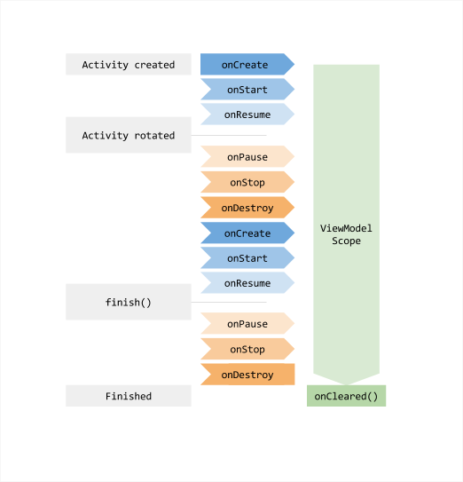

# Android MVVM: ViewModel, LiveData, and Unidirectional Data Flow
## ViewModel (Android Jetpack Architecture Component)

**Khái niệm:**
ViewModel là một thành phần của Android Jetpack (Architecture Components) đóng vai trò như mô hình trạng thái của UI. Nó giữ và quản lý dữ liệu liên quan tới giao diện (UI state), đồng thời tồn tại vượt qua các vòng đời của Activity/Fragment (ví dụ: khi xoay màn hình).
Nói cách khác, ViewModel lưu trữ trạng thái UI và logic xử lý dữ liệu cấp màn hình, giúp dữ liệu không bị mất khi Activity/Fragment bị hủy và tái tạo bởi hệ thống (như khi chuyển đổi cấu hình màn hình).

---

## Tính bền vững (Persistence)

* ViewModel ghi nhớ dữ liệu và cả các tác vụ bất đồng bộ đang chạy, nên tránh được việc phải tải lại dữ liệu sau những thay đổi cấu hình thông thường (ví dụ: không cần gọi API lại khi xoay màn hình).
* ViewModel caching trạng thái này đồng nghĩa UI có thể nhanh chóng khôi phục lại dữ liệu mà không cần truy cập mạng hay ổ đĩa lặp lại.
* Thay vì sử dụng các lớp Activity để lưu trữ dữ liệu (dễ bị mất khi Activity bị destroy), ViewModel cung cấp một API thuận tiện để lưu trữ và phục hồi dữ liệu UI xuyên suốt vòng đời biến động của UI.

**Ví dụ:**

```kotlin
class CounterViewModel : ViewModel() {
    val count = MutableLiveData(0)
    fun increase() {
        count.value = (count.value ?: 0) + 1
    }
}
```

```kotlin
// Trong Activity
viewModel.count.observe(this) {
    textView.text = it.toString()
}
button.setOnClickListener {
    viewModel.increase()
}
```

→ Dù xoay màn hình, giá trị `count` vẫn giữ nguyên, không bị đặt lại về 0.

---

## Phạm vi sống (Scope)

* Mỗi ViewModel được gắn với một `ViewModelStoreOwner` (thường là một Activity, Fragment hoặc một navigation back-stack entry).
* ViewModel sẽ tồn tại trong bộ nhớ cho đến khi `ViewModelStoreOwner` đó bị hủy hoàn toàn.

**Chi tiết:**

* Với Activity: ViewModel chỉ bị hủy khi Activity kết thúc hẳn (`finish()`).
* Với Fragment: ViewModel bị hủy khi Fragment bị tháo khỏi giao diện (`detached`) hoặc bị `pop` khỏi `back stack`.
* Các tác vụ nền (như gọi mạng, coroutine) trong ViewModel vẫn tiếp tục chạy ngay cả khi Activity/Fragment tạm thời bị destroy do thay đổi cấu hình.
* ViewModel chỉ bị dọn khỏi bộ nhớ khi vòng đời scope của nó chấm dứt – ví dụ khi người dùng nhấn nút Back thoát hẳn Activity/Fragment thì ViewModel sẽ bị hủy và giải phóng.
* Ngược lại, nếu người dùng chỉ nhấn Home để ứng dụng về background, Activity chỉ dừng/tạm dừng chứ chưa bị destroy, nên ViewModel vẫn được giữ lại. Chỉ khi hệ thống buộc kill tiến trình ứng dụng thì ViewModel mới mất theo.
* Khi ViewModel bị hủy, hệ thống sẽ gọi phương thức `onCleared()` để ta giải phóng tài nguyên nếu cần (dừng các coroutine, unregister listener,...).

**Ví dụ:**

```kotlin
override fun onCleared() {
    super.onCleared()
    job.cancel() // Hủy các tác vụ nền
}
```

---

## SavedStateHandle

* Mặc định, ViewModel không tự động giữ lại dữ liệu khi ứng dụng bị kill (do hệ thống thu hồi tài nguyên khi ở nền hoặc người dùng vuốt tắt app khỏi Recents).
* Để hỗ trợ phục hồi trạng thái sau khi process bị kill, ta có thể dùng `SavedStateHandle` – một đối tượng đặc biệt được truyền vào ViewModel (nếu sử dụng `ViewModelProvider.Factory`).
* `SavedStateHandle` cho phép lưu các giá trị cần thiết và tự động phục hồi khi ViewModel được tạo lại sau khi app mở lại.
* Kết hợp ViewModel với `SavedStateHandle` sẽ giúp giữ dữ liệu ngay cả khi app bị kill và mở lại, thỏa mãn cả hai trường hợp: thay đổi cấu hình và khởi động lại quy trình.

**Ví dụ:**

```kotlin
class TaskViewModel(private val state: SavedStateHandle) : ViewModel() {
    val title = state.getLiveData<String>("title")
    fun saveTitle(t: String) {
        state["title"] = t
    }
}
```

---

## Vòng đời của ViewModel

* ViewModel bắt đầu tồn tại khi Activity được tạo lần đầu.
* ViewModel sống sót qua sự kiện xoay màn hình (Activity bị destroy và tạo lại).
* ViewModel chỉ bị hủy (gọi `onCleared()`) khi Activity/Fragment kết thúc hẳn (`finish()` hoặc `popBackStack()`).
* Nhấn Back → Activity/Fragment bị hủy vĩnh viễn → ViewModel bị xóa.
* Nhấn Home → Activity dừng (`onStop`) nhưng chưa bị hủy → ViewModel vẫn được giữ lại.




Vòng đời của ViewModel so với Activity. ViewModel bắt đầu tồn tại khi Activity được tạo lần đầu, sống sót qua sự kiện xoay màn hình (Activity bị destroy và tạo lại), và chỉ bị hủy (gọi onCleared()) khi Activity kết thúc hẳn (finish). Các sự kiện nhấn Back dẫn tới Activity/Fragment bị hủy vĩnh viễn, do đó ViewModel bị xóa; còn khi chỉ tạm thoát (Home) thì Activity dừng nhưng chưa bị hủy, ViewModel vẫn được giữ lại trong bộ nhớ
---

---

## Lưu ý khi sử dụng

* ViewModel không nên chứa tham chiếu trực tiếp đến View hay Context (Activity) của ứng dụng, bởi vì ViewModel có vòng đời dài hơn UI. Việc giữ tham chiếu UI trong ViewModel có thể gây rò rỉ bộ nhớ nếu UI đã bị hủy mà ViewModel vẫn còn sống.
* Thay vào đó, ViewModel nên hoàn toàn tách biệt với lớp View, chỉ cung cấp dữ liệu và logic cần thiết.
* Nên tận dụng `viewModelScope` (CoroutineScope tích hợp sẵn) để chạy các công việc nền trong ViewModel và tự động hủy khi ViewModel bị xóa, giúp tránh rò rỉ luồng chạy ngầm.

**Ví dụ:**

```kotlin
viewModelScope.launch {
    val data = repository.loadData()
    _items.postValue(data)
}
```

---
## LiveData (Observable Data Holder — dữ liệu có thể quan sát được)

LiveData là một lớp quản lý dữ liệu có thể quan sát (observable) và nhận biết vòng đời (lifecycle-aware) của các thành phần Android như Activity, Fragment.
Nó hoạt động như một lớp bao dữ liệu, cho phép các thành phần khác đăng ký quan sát dữ liệu. Khi dữ liệu bên trong LiveData thay đổi, nó sẽ phát tín hiệu tới tất cả các Observer đang hoạt động (active) để các Observer đó cập nhật giao diện hoặc thực hiện hành động phù hợp.
Nhờ cơ chế này, UI luôn được cập nhật đúng với trạng thái dữ liệu, và ta không cần viết code cập nhật UI thủ công mỗi khi dữ liệu đổi.

---

## Lifecycle-aware

LiveData chỉ gửi dữ liệu đến Observer khi LifecycleOwner tương ứng đang ở trạng thái STARTED hoặc RESUMED.
Nếu Activity/Fragment đang ở trạng thái PAUSED/STOPPED hoặc đã DESTROYED, LiveData sẽ tạm ngưng gửi sự kiện để tránh cập nhật UI không cần thiết (tránh crash khi màn hình đã đóng).
Khi LifecycleOwner bị destroy, LiveData sẽ tự động gỡ observer đi, tránh rò rỉ bộ nhớ.
Cơ chế này giúp lập trình viên không cần quản lý thủ công việc đăng ký/hủy đăng ký Observer khi vòng đời thay đổi.

---

## Các loại LiveData

### LiveData (immutable)

* Chỉ cho phép quan sát dữ liệu, không có phương thức công khai để thay đổi giá trị bên trong.
* Dùng để public dữ liệu ra UI ở dạng chỉ đọc.

### MutableLiveData

* Là subclass của LiveData, có thể thay đổi dữ liệu bằng setValue() hoặc postValue().
* Thường dùng trong ViewModel để cập nhật dữ liệu, nhưng chỉ expose ra dưới dạng LiveData để UI không thể sửa trực tiếp.

```kotlin
class MyViewModel : ViewModel() {
    private val _text = MutableLiveData<String>()
    val text: LiveData<String> get() = _text

    fun updateText(value: String) {
        _text.value = value
    }
}
```

```kotlin
viewModel.text.observe(viewLifecycleOwner) {
    textView.text = it
}
button.setOnClickListener {
    viewModel.updateText("Xin chào")
}
```

### MediatorLiveData

* Cho phép quan sát nhiều LiveData nguồn khác nhau và hợp nhất chúng.
* Khi một trong các LiveData nguồn thay đổi, MediatorLiveData sẽ nhận sự kiện và xử lý logic hợp nhất rồi phát ra giá trị mới.

```kotlin
val name = MutableLiveData<String>()
val age = MutableLiveData<Int>()

val combined = MediatorLiveData<String>().apply {
    addSource(name) { n -> value = "$n - ${age.value}" }
    addSource(age) { a -> value = "${name.value} - $a" }
}

combined.observe(viewLifecycleOwner) {
    textView.text = it
}
```

---

## Cách hoạt động

* LiveData thường nằm trong ViewModel để giữ dữ liệu UI.
* Ở Activity/Fragment, ta đăng ký Observer với LiveData thông qua `observe()`.
* Khi ViewModel cập nhật giá trị (setValue/postValue), LiveData sẽ phát sự kiện đến mọi Observer đang active.
* Khi Observer vừa đăng ký, LiveData sẽ gửi ngay giá trị gần nhất nếu có.

```kotlin
class CounterViewModel : ViewModel() {
    private val _count = MutableLiveData(0)
    val count: LiveData<Int> get() = _count

    fun increase() {
        _count.value = (_count.value ?: 0) + 1
    }
}
```

```kotlin
viewModel.count.observe(this) {
    textView.text = it.toString()
}
button.setOnClickListener {
    viewModel.increase()
}
```

---

## Cập nhật dữ liệu

* `setValue(T)` dùng khi đang ở main thread.
* `postValue(T)` dùng khi đang ở background thread (nó sẽ post sang main thread để cập nhật sau).

```kotlin
_text.value = "Hello"       // main thread
_text.postValue("Hello")    // background thread
```

Khi giá trị thay đổi, LiveData sẽ phát sự kiện cho tất cả Observer đang active để UI cập nhật.

---

## Ưu điểm

* Đồng bộ UI với dữ liệu: mọi thay đổi dữ liệu tự đẩy lên UI qua Observer.
* Không rò rỉ bộ nhớ: Observer tự hủy khi LifecycleOwner bị destroy.
* Tránh crash khi UI ngừng: chỉ gửi dữ liệu khi UI đang active.
* Tự động quản lý vòng đời: không cần đăng ký/hủy đăng ký thủ công.
* Luôn cập nhật giá trị mới nhất: khi UI quay lại foreground, Observer nhận ngay dữ liệu mới nhất.
* Xử lý tốt thay đổi cấu hình: khi Activity/Fragment được tạo lại, LiveData vẫn giữ giá trị gần nhất nên không cần tải lại dữ liệu.

---

## Kết hợp với ViewModel trong MVVM

* ViewModel chứa MutableLiveData để lưu và cập nhật dữ liệu.
* UI chỉ quan sát LiveData từ ViewModel và hiển thị.
* Giúp tách biệt rõ ràng giữa tầng dữ liệu và tầng giao diện, dễ bảo trì và kiểm thử.

---
## Kiến trúc MVVM (Model – View – ViewModel)

**Model–View–ViewModel (MVVM)** là mẫu kiến trúc được **Google khuyến nghị** cho ứng dụng Android hiện đại, đặc biệt khi sử dụng **Android Jetpack Architecture Components** như ViewModel, LiveData, Room…
Mục tiêu của MVVM là **tách biệt rõ ràng phần logic và phần giao diện**, tránh tình trạng **“Massive Activity/Fragment”** — khi Activity phải gánh quá nhiều trách nhiệm, gây khó bảo trì và mở rộng.

---

## 1) Thành phần chính trong MVVM

### Model (M)

* Đại diện cho dữ liệu và logic nghiệp vụ.
* Bao gồm:

    * Các lớp dữ liệu (data class / POJO)
    * DAO (Room) hoặc API service (Retrofit)
    * Repository (lớp trung gian giữa dữ liệu và ViewModel)
* Nhiệm vụ:

    * Lấy, lưu, xử lý, đồng bộ dữ liệu
    * Không phụ thuộc vào UI, dễ tái sử dụng và dễ kiểm thử

---

### View (V)

* Đại diện cho giao diện người dùng.
* Bao gồm:

    * Activity / Fragment (màn hình)
    * Layout XML + Adapter (RecyclerView…)
* Nhiệm vụ:

    * Quan sát LiveData từ ViewModel để cập nhật UI
    * Nhận tương tác người dùng (click, nhập liệu…)
    * Không chứa logic nghiệp vụ, không giữ dữ liệu lâu dài
    * Gửi sự kiện người dùng lên ViewModel xử lý

---

### ViewModel (VM)

* Cầu nối giữa View và Model.
* Nhiệm vụ:

    * Lấy dữ liệu từ Repository/Model
    * Xử lý, định dạng dữ liệu để hiển thị
    * Giữ trạng thái UI bằng LiveData hoặc StateFlow
    * Nhận sự kiện từ View để cập nhật Model hoặc thay đổi trạng thái
* Đặc điểm:

    * Không tham chiếu trực tiếp tới View/Context để tránh rò rỉ bộ nhớ
    * Tồn tại lâu hơn vòng đời của View (sống sót qua xoay màn hình…)

---

## 2) Dòng dữ liệu một chiều (Unidirectional Data Flow – UDF)

MVVM áp dụng mô hình dòng dữ liệu một chiều:

* **Dữ liệu đi xuống:** `Model → ViewModel → View`
* **Sự kiện đi lên:** `View → ViewModel → Model`

Quy trình:

1. **View** tạo **ViewModel** và `observe()` LiveData trong đó.
2. **ViewModel** gọi **Repository (Model)** để lấy dữ liệu (bất đồng bộ qua coroutine/Flow).
3. Khi **Model** trả về dữ liệu, **ViewModel** cập nhật LiveData.
4. **View** nhận thay đổi qua Observer và tự động cập nhật UI.
5. Người dùng thao tác → **View** gọi hàm trong **ViewModel** → **ViewModel** xử lý và cập nhật dữ liệu → **LiveData đổi → View đổi UI**.

Nhờ đó, dữ liệu chỉ chảy theo một chiều, không có việc View tự ý sửa dữ liệu hoặc Model tự đẩy dữ liệu lên UI.

---

## 3) Ví dụ đơn giản minh họa MVVM

**Model**

```kotlin
@Entity
data class Task(
    @PrimaryKey(autoGenerate = true) val id: Long = 0,
    val title: String, val done: Boolean = false
)

@Dao
interface TaskDao {
    @Query("SELECT * FROM task") fun all(): Flow<List<Task>>
    @Insert suspend fun insert(t: Task)
    @Query("UPDATE task SET done=:v WHERE id=:id") suspend fun setDone(id: Long, v: Boolean)
    @Delete suspend fun delete(t: Task)
}

@Database(entities = [Task::class], version = 1)
abstract class AppDb : RoomDatabase() {
    abstract fun dao(): TaskDao
    companion object {
        fun get(c: Context) = Room.databaseBuilder(c, AppDb::class.java, "todo.db").build()
    }
}

class TaskRepo(private val dao: TaskDao) {
    fun all() = dao.all()
    suspend fun add(t: String) = dao.insert(Task(title = t))
    suspend fun toggle(x: Task) = dao.setDone(x.id, !x.done)
    suspend fun delete(x: Task) = dao.delete(x)
}
```

**ViewModel**

```kotlin
class TaskVM(app: Application) : AndroidViewModel(app) {
    private val repo = TaskRepo(AppDb.get(app).dao())
    val tasks = repo.all().asLiveData()

    fun add(t: String) = viewModelScope.launch(Dispatchers.IO) { repo.add(t) }
    fun toggle(x: Task) = viewModelScope.launch(Dispatchers.IO) { repo.toggle(x) }
    fun delete(x: Task) = viewModelScope.launch(Dispatchers.IO) { repo.delete(x) }
}
```

**View (Fragment)**

```kotlin
class TaskFragment : Fragment() {
    private val vm: TaskVM by viewModels()
    private lateinit var ad: TaskAdapter

    override fun onViewCreated(v: View, s: Bundle?) {
        ad = TaskAdapter(
            onToggle = { vm.toggle(it) },
            onDelete = { vm.delete(it) }
        )
        rv.adapter = ad
        vm.tasks.observe(viewLifecycleOwner) { ad.submitList(it) }

        btnAdd.setOnClickListener {
            vm.add(edt.text.toString()); edt.setText("")
        }
    }
}
```

**item\_task.xml**

```xml
<LinearLayout ...>
  <CheckBox android:id="@+id/chk" .../>
  <TextView android:id="@+id/txt" .../>
  <Button android:id="@+id/btnDel" android:text="Xóa" .../>
</LinearLayout>
```

---

## 4) Ưu điểm của kiến trúc MVVM

* Phân tách rõ ràng từng tầng: View chỉ hiển thị, Model chỉ quản lý dữ liệu, ViewModel điều phối logic.
* Dễ mở rộng, dễ bảo trì, dễ kiểm thử đơn vị.
* LiveData tự động quản lý vòng đời, tránh rò rỉ bộ nhớ.
* ViewModel giữ được dữ liệu khi xoay màn hình, không mất trạng thái UI.
* Dòng dữ liệu một chiều → dễ theo dõi luồng xử lý.

---

## 5) Kết luận

MVVM là kiến trúc tiêu chuẩn hiện đại cho Android.
Với MVVM, **View chỉ quan sát và hiển thị**, **ViewModel giữ trạng thái UI và xử lý logic**, **Model quản lý dữ liệu**.
Cách phân tách này giúp **code dễ đọc, dễ kiểm thử, dễ bảo trì** và **tránh lỗi UI phức tạp**.
## Unidirectional Data Flow (UDF – Luồng dữ liệu một chiều)

**Unidirectional Data Flow (UDF)** là một mẫu kiến trúc quan trọng trong các ứng dụng Android hiện đại, đặc biệt khi kết hợp cùng mô hình **MVVM (Model–View–ViewModel)**.

Mục tiêu chính của UDF là:

* Tất cả **dữ liệu chỉ chảy xuống theo một chiều duy nhất**: từ tầng dữ liệu → ViewModel → View (UI)
* Và **mọi sự kiện người dùng chỉ chảy ngược lên**: từ View → ViewModel → tầng dữ liệu.

Nhờ vậy, toàn bộ ứng dụng sẽ có **một nguồn trạng thái duy nhất (single source of truth)**, tránh được các luồng dữ liệu rối rắm và khó kiểm soát.

---

## 1) Luồng dữ liệu trong UDF

* **Chiều đi xuống (Downstream):**

    * Dữ liệu từ tầng **Model** (database, API, repository…) được lấy về.
    * **ViewModel** xử lý/biến đổi dữ liệu này thành **UI state** (dữ liệu phù hợp để hiển thị).
    * **View (UI)** đăng ký quan sát (`observe`) `state` từ ViewModel, và **tự động cập nhật** mỗi khi dữ liệu thay đổi.

* **Chiều đi lên (Upstream):**

    * Người dùng thao tác với UI (nhấn nút, nhập liệu...).
    * **View** gửi sự kiện (event) lên **ViewModel** (thông qua gọi hàm).
    * **ViewModel xử lý sự kiện**, có thể gọi **Model** để thay đổi dữ liệu.
    * Sau khi xử lý, ViewModel **cập nhật lại UI state**, và vòng lặp bắt đầu lại.

**Lưu ý quan trọng:**
View **không** được phép thay đổi Model trực tiếp. Model **không** được phép tự ý đẩy dữ liệu lên UI.
Mọi thứ **bắt buộc đi qua ViewModel** → đảm bảo **luồng dữ liệu duy nhất, dễ kiểm soát**.

---

## 2) Ưu điểm khi áp dụng UDF

* **Một nguồn sự thật duy nhất (Single Source of Truth)**

    * Tất cả trạng thái UI đều đến từ ViewModel.
    * UI không tự giữ biến riêng, tránh sai lệch dữ liệu giữa các phần của ứng dụng.

* **Dễ dàng kiểm thử (Testable)**

    * Logic xử lý tập trung trong ViewModel → có thể viết unit test kiểm tra dữ liệu và sự kiện độc lập với UI.

* **Dễ bảo trì, dễ mở rộng**

    * Luồng xử lý rõ ràng, dễ lần theo.
    * Khi thêm tính năng, chỉ cần thêm `state` và xử lý trong ViewModel.
    * Mọi thay đổi trạng thái đều qua một nơi duy nhất nên dễ kiểm soát lỗi và side-effects.

* **Tách biệt rõ ràng giữa UI và logic**

    * UI chỉ hiển thị (render), không chứa logic nghiệp vụ.
    * Logic nghiệp vụ và xử lý dữ liệu nằm trong ViewModel/Model → dễ thay đổi giao diện mà không ảnh hưởng đến logic.

---

## 3) Triển khai UDF trong Android

UDF thường được triển khai thông qua **MVVM**:

* **Model**: nguồn dữ liệu gốc (Room, Retrofit, Repository…)
* **ViewModel**: giữ trạng thái (`LiveData`, `StateFlow`) và xử lý sự kiện từ View
* **View (UI)**: chỉ `observe()` dữ liệu và gọi hàm của ViewModel khi có sự kiện

**Ví dụ đơn giản: đếm số lần bấm nút**

```kotlin
// ViewModel giữ state
class CounterViewModel : ViewModel() {
    private val _count = MutableLiveData(0)
    val count: LiveData<Int> = _count

    fun increase() {
        _count.value = (_count.value ?: 0) + 1
    }
}
```

```kotlin
// Fragment quan sát state và gửi event
class CounterFragment : Fragment() {
    private val vm: CounterViewModel by viewModels()

    override fun onViewCreated(view: View, savedInstanceState: Bundle?) {
        vm.count.observe(viewLifecycleOwner) { txtCount.text = it.toString() }
        btnIncrease.setOnClickListener { vm.increase() }
    }
}
```

**Giải thích:**

* `count` là **UI state duy nhất** nằm trong ViewModel.
* `increase()` là **xử lý sự kiện** → thay đổi `state`.
* Khi `state` đổi, **View tự động nhận và cập nhật UI**.

---

## 4) Kết hợp UDF với LiveData / StateFlow

* Dùng `LiveData` hoặc `StateFlow` trong ViewModel để chứa `state`.
* View đăng ký `observe()` / `collect()` để hiển thị dữ liệu mới mỗi khi `state` thay đổi.
* Khi người dùng thao tác, View gọi hàm ViewModel → ViewModel thay đổi `state` → UI tự động render lại.
* Nếu cần dữ liệu từ Model (Room, API), lấy về và cập nhật vào `state`.

---

## 5) Lợi ích tổng quát

* Tránh luồng dữ liệu vòng lặp khó kiểm soát
* Tránh lỗi hiển thị dữ liệu cũ, dữ liệu sai lệch
* Hồi phục tốt khi cấu hình thay đổi (xoay màn hình) vì `state` vẫn nằm trong ViewModel
* Đảm bảo ứng dụng dễ mở rộng, dễ test, dễ bảo trì

---

## 6) Tóm tắt

**Unidirectional Data Flow + MVVM** tạo nên một kiến trúc vững chắc cho Android:

* **Dữ liệu chảy xuống (Model → ViewModel → View)**
* **Sự kiện đi lên (View → ViewModel → Model)**
* **ViewModel là trung tâm**: giữ state, xử lý sự kiện, điều phối dữ liệu
* **UI chỉ quan sát và hiển thị state**, không chứa logic


